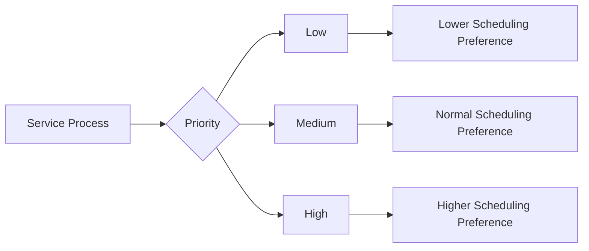
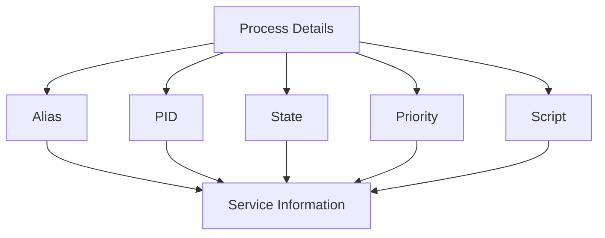

# Assignment-6_Linux

## 🎯 Objective

Practice **Linux process management, monitoring, scheduling, and service management** by creating shell-script based process management utilities.

The assignment is divided into three parts:

* 🔹 **Part A:** Process Management Utility
* 🔹 **Part B:** Process Manager Utility
* 🔹 **Part C:** Practical Process Management

---

# 📂 Part A: Process Management Utility

## 🎯 Objective

Create a process management utility named **`otProcessManager`** to monitor and manage processes running on a Linux system.

### 📌 Utility Syntax

```bash
./otProcessManager <operation> [arguments]
```

---

## 📍 Task 1: Top N Processes by Memory

Find the top **N processes** based on memory consumption.

### 🔹 Command

```bash
./otProcessManager topProcess 5 memory
```

### 📝 Example

```text
Top 5 processes by memory
```


---

## 📍 Task 2: Top N Processes by CPU

Find the top **N processes** based on CPU consumption.

### 🔹 Command

```bash
./otProcessManager topProcess 10 cpu
```

### 📝 Example

```text
Top 10 processes by CPU
```


---

## 📍 Task 3: Kill Process Having Least Priority

Find and terminate the process having the lowest priority.

### 🔹 Command

```bash
./otProcessManager killLeastPriorityProcess
```


---

## 📍 Task 4: Find Running Duration of a Process

Find how long a particular process has been running.

### 🔹 Using Process Name

```bash
./otProcessManager RunningDurationProcess <processName>
```

### 🔹 Using Process ID

```bash
./otProcessManager RunningDurationProcess <processID>
```

### 📝 Example

```bash
./otProcessManager RunningDurationProcess slack
```

or

```bash
./otProcessManager RunningDurationProcess 7213
```


---

## 📍 Task 5: List Orphan Processes

Find orphan processes running on the system.

### 🔹 Command

```bash
./otProcessManager listOrphanProcess
```

### 📖 Definition

An **orphan process** is a process whose parent process has terminated while the child process is still running.


---

## 📍 Task 6: List Zombie Processes

Find zombie processes running on the system.

### 🔹 Command

```bash
./otProcessManager listZoombieProcess
```

### 📖 Definition

A **zombie process** is a process that has completed execution but still has an entry in the process table because its parent has not collected its exit status.


---

## 📍 Task 7: Kill Process by Name or PID

Terminate a process using either its name or PID.

### 🔹 Using Process Name

```bash
./otProcessManager killProcess <processName>
```

### 🔹 Using Process ID

```bash
./otProcessManager killProcess <processID>
```

### 📝 Example

```bash
./otProcessManager killProcess snap-store
```

or

```bash
./otProcessManager killProcess 10289
```


---

## 📍 Task 8: List Processes Waiting for Resources

Find processes that are currently waiting for resources.

### 🔹 Command

```bash
./otProcessManager ListWaitingProcess
```


---

# 📂 Part B: Process Manager Utility

## 🎯 Objective

Create a **`ProcessManager.sh`** utility that can register scripts as services and manage those services.

The utility should support:

* 📝 Register a service
* ▶️ Start a service as a daemon
* 🔍 Check service status
* 🛑 Stop a service
* ⚡ Change process priority
* 📋 List registered services
* 📊 Display process details

## 📍 Task 1: Register a Service

Register a script with a service alias.

### 🔹 Command

```bash
./ProcessManager.sh -o register -s <path> -a <alias>
```

### 📝 Example

```bash
./ProcessManager.sh -o register -s /home/user/service1.sh -a service1
```

### 📖 Explanation

* `-o register` → Register operation
* `-s` → Script path
* `-a` → Service alias


---

## 📍 Task 2: Start a Service

Start the registered service as a daemon/background process.

### 🔹 Command

```bash
./ProcessManager.sh -o start -a <alias>
```

### 📝 Example

```bash
./ProcessManager.sh -o start -a service1
```


## 📍 Task 3: Check Service Status

Check whether a particular service is running.

### 🔹 Command

```bash
./ProcessManager.sh -o status -a <alias>
```

### 📝 Example

```bash
./ProcessManager.sh -o status -a service1
```

### 💡 Expected Output

```text
service1 is running
PID: 2456
```

If the service is stopped:

```text
service1 is not running
```


---

## 📍 Task 4: Stop a Service

Stop a particular service.

### 🔹 Command

```bash
./ProcessManager.sh -o kill -a <alias>
```

### 📝 Example

```bash
./ProcessManager.sh -o kill -a service1
```


---

## 📍 Task 5: Change Process Priority

Change the priority of a service.

### 🔹 Command

```bash
./ProcessManager.sh -o priority -p <low/med/high> -a <alias>
```

### 📝 Examples

```bash
./ProcessManager.sh -o priority -p low -a service1
```

```bash
./ProcessManager.sh -o priority -p med -a service1
```

```bash
./ProcessManager.sh -o priority -p high -a service1
```


---

## 📊 Figure 5: Process Priority



> 💡 Linux process priority is commonly controlled using the **nice value**. A lower nice value generally gives a process a higher scheduling priority.

---

## 📍 Task 6: List Registered Services

Display all services registered with the utility.

### 🔹 Command

```bash
./ProcessManager.sh -o list
```

### 📝 Example Output

```text
service2
service1
service3
```


---

## 📍 Task 7: Display Process Details

Display details of all processes started by the utility.

### 🔹 Command

```bash
./ProcessManager.sh -o top
```

To display details of a particular service:

```bash
./ProcessManager.sh -o top -a <alias>
```


---

## 📊 Figure 6: Process Details



---

# 📂 Part C: Play Around With Processes

## 🎯 Objective

Perform practical experiments to understand how Linux handles processes, log files, file descriptors, and process priorities.

---

## 📍 Task 1: Display Running Process

First identify the running process:

```bash
ps -ef
```


Clear the contents of the log file:
```bash 
> application.log
```
or:

```bash
truncate -s 0 application.log
```
### 📖 Observation

The process continues running because only the contents of the log file are cleared.

---

## 📍 Task 2: Delete a Log File of a Running Process

### Delete the log file:

```bash
rm application.log
```

Check whether the running process still has the deleted file open:

```bash
lsof | grep deleted
```

### 📖 Observation

If a running process has the file open, deleting the file name does not immediately terminate the process.

The process can continue using its open file descriptor.

--- 
## 📍 Task 3: Elevate the Priority of a Process

### 🔹 Display Processes

```bash
ps -ef
```

### 🔹 Display Detailed Process Information

```bash
ps -eo pid,ppid,user,%cpu,%mem,stat,ni,comm
```


### 🔹 Change Process Priority

```bash
renice -n <value> -p <PID>
```


---


# ▶️ Execution

## 🔹 Give Execute Permission

```bash
chmod +x otProcessManager
chmod +x ProcessManager.sh
```

## 🔹 Run Part A

```bash
./otProcessManager topProcess 5 memory
```

## 🔹 Register a Service

```bash
./ProcessManager.sh -o register -s /path/to/service.sh -a service1
```

## 🔹 Start the Service

```bash
./ProcessManager.sh -o start -a service1
```

## 🔹 Check Status

```bash
./ProcessManager.sh -o status -a service1
```

## 🔹 Display Process Details

```bash
./ProcessManager.sh -o top
```

## 🔹 Stop the Service

```bash
./ProcessManager.sh -o kill -a service1
```

---

# 🎓 Learning Outcomes

After completing this assignment, you will be able to:

* ✅ Monitor CPU and memory usage of processes.
* ✅ Find and manage processes using PID and process name.
* ✅ Identify orphan processes.
* ✅ Identify zombie processes.
* ✅ Find processes waiting for resources.
* ✅ Understand process priority and nice values.
* ✅ Start and manage daemon processes.
* ✅ Register and manage services using a Bash utility.
* ✅ Check process status.
* ✅ Change process priority.
* ✅ Understand Linux file descriptors.
* ✅ Understand the effect of clearing and deleting files used by running processes.

---

# 🚫 Important Notes

* 🐧 The assignment should be performed on a Linux system.
* 🔐 Some process-management operations may require `sudo`.
* ⚡ Be careful while using `kill` and `renice` on system processes.
* 📝 Test process-management commands on safe/user-created processes whenever possible.

---

# 🏁 Assignment Summary

| Part      | Topic                           | Utility             |
| --------- | ------------------------------- | ------------------- |
| 📌 Part A | Process Monitoring & Management | `otProcessManager`  |
| 📌 Part B | Service Management              | `ProcessManager.sh` |
| 📌 Part C | Process Experiments             | Linux Commands      |


## 🏁 Happy Learning! 🚀
