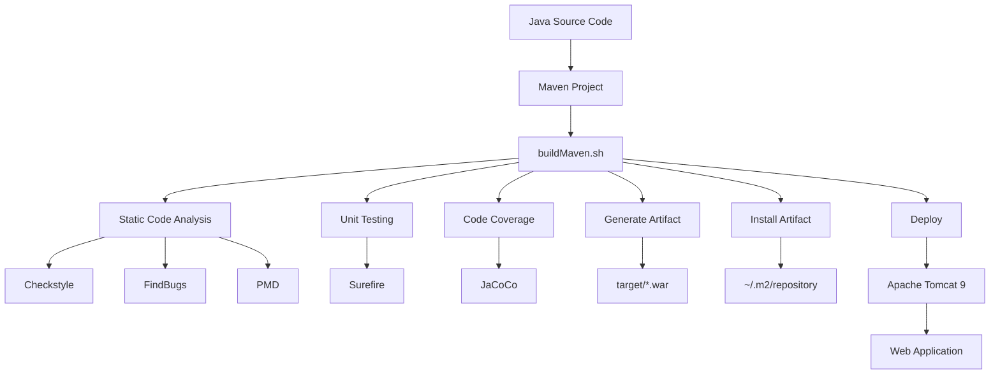
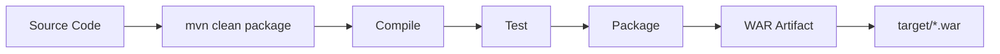
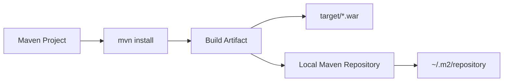
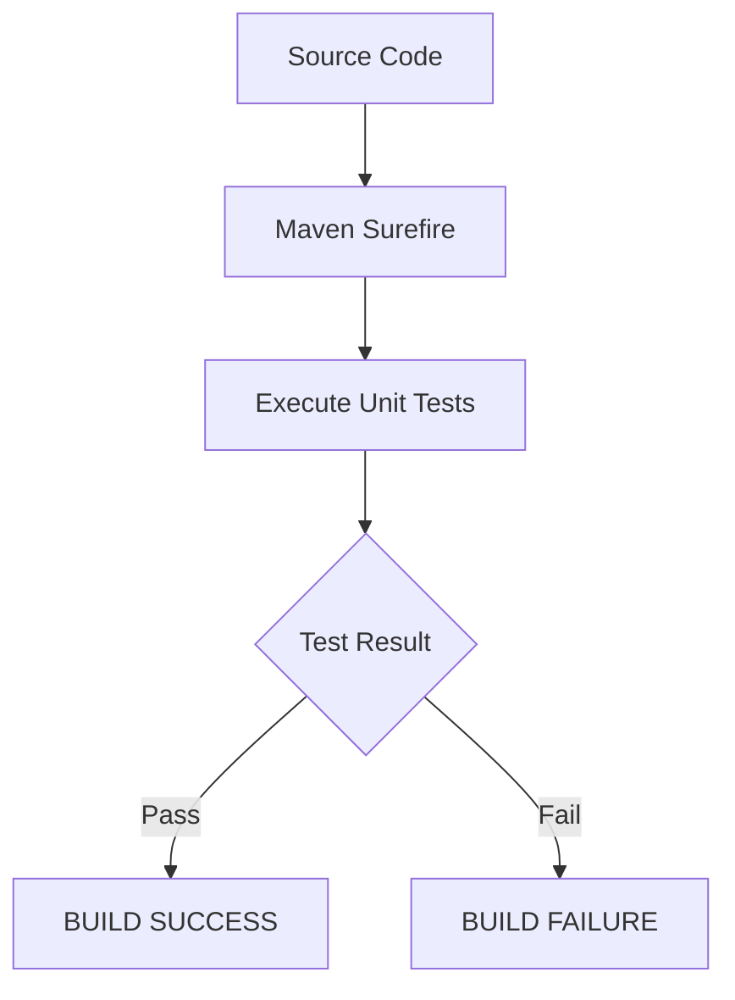
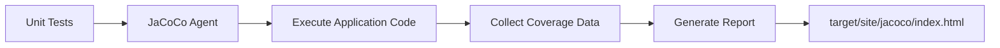
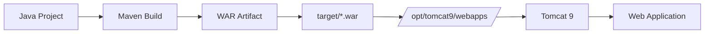
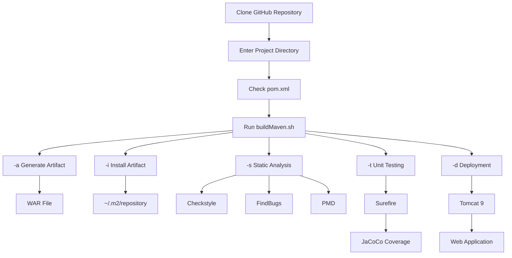

# Assignment-7_Linux

## 📌 Objective

The objective of this assignment is to create a Bash utility named `buildMaven.sh` to manage common build operations of a Maven-based Java project.

The utility supports:

* Generate project artifact
* Install artifact into local Maven repository
* Perform static code analysis

  * Checkstyle
  * FindBugs
  * PMD
* Execute unit tests
* Generate code coverage
* Deploy WAR artifact to Apache Tomcat
* Generate application documentation *(optional)*

---

## 📂 Project Used

GitHub Repository:

https://github.com/opstree/spring3hibernate.git

Clone the repository:

```bash
git clone https://github.com/opstree/spring3hibernate.git
cd spring3hibernate
```

---

# 🏗️ Overall Architecture



---

# 🔧 Prerequisites

Install/check the following:

### Java

```bash
java -version
```

Example:

```text
openjdk version "11.0.31"
```

### Maven

```bash
mvn -version
```

### Git

```bash
git --version
```

### Tomcat

Tomcat 9 is installed manually under:

```text
/opt/tomcat9
```

Check:

```bash
ls /opt/tomcat9
```


---

# 📁 Project Structure

```text
spring3hibernate/
│
├── pom.xml
├── buildMaven.sh
├── README.md
│
├── src/
│   ├── main/
│   │   ├── java/
│   │   └── resources/
│   │
│   └── test/
│       └── java/
│
└── target/
```

After building and testing:

```text
spring3hibernate/
│
├── pom.xml
├── buildMaven.sh
├── src/
│
└── target/
    ├── *.war
    ├── surefire-reports/
    └── site/
        └── jacoco/
            ├── index.html
            ├── jacoco.csv
            └── jacoco.xml
```

---

# 🚀 buildMaven.sh

The main utility is:

```bash
buildMaven.sh
```

Make the script executable:

```bash
chmod +x buildMaven.sh
```

Run help:

```bash
./buildMaven.sh -h
```

---

# 🏷️ Command-Line Options

| Flag   | Operation                            |
| ------ | ------------------------------------ |
| `-a`   | Generate artifact                    |
| `-i`   | Install artifact to local repository |
| `-s`   | Perform static code analysis         |
| `-t`   | Run unit tests and code coverage     |
| `-d`   | Deploy artifact to Tomcat            |
| `-doc` | Generate documentation               |
| `-h`   | Display help                         |

---

# 1️⃣ Generate Artifact

Command:

```bash
./buildMaven.sh -a
```


This generates the Maven project artifact.

Internally, Maven performs:

```bash
mvn clean package
```

The generated WAR file is placed inside:

```text
target/
```

Example:

```text
target/Spring3HibernateApp.war
```


## Figure — Artifact Generation



Check the artifact:

```bash
ls -lh target/
```


---

# 2️⃣ Install Artifact to Local Repository

Command:

```bash
./buildMaven.sh -i
```


Equivalent Maven command:

```bash
mvn install
```

The artifact is installed into the local Maven repository:

```text
~/.m2/repository/
```


## Figure — Maven Local Repository



Check:

```bash
ls ~/.m2/repository/
```

---

# 3️⃣ Static Code Analysis

The utility supports:

```text
checkstyle
findbugs
pmd
```

Syntax:

```bash
./buildMaven.sh -s <tool>
```

---

## 🔹 Checkstyle

Run:

```bash
./buildMaven.sh -s checkstyle
```


---

## 🔹 FindBugs

Run:

```bash
./buildMaven.sh -s findbugs
```


---

## 🔹 PMD

Run:

```bash
./buildMaven.sh -s pmd
```


---

# 4️⃣ Unit Testing

The assignment uses Maven Surefire for unit testing.

Command:

```bash
./buildMaven.sh -t surefire
```


Equivalent Maven operation:

```bash
mvn test
```

Test reports are generated in:

```text
target/surefire-reports/
```

Check:

```bash
ls target/surefire-reports/
```


---

## 🧪 Test Result

The project successfully executed:

```text
Tests run: 3
Failures: 0
Errors: 0
Skipped: 0
```

Therefore:

```text
Unit Tests = SUCCESS
```

### Figure — Unit Testing



---

# 5️⃣ Code Coverage

Code coverage measures how much application code is executed by unit tests.

The project uses **JaCoCo** for code coverage.

Add the JaCoCo plugin inside the existing `<plugins>` section of `pom.xml`:

```xml
<plugin>
    <groupId>org.jacoco</groupId>
    <artifactId>jacoco-maven-plugin</artifactId>
    <version>0.8.13</version>

    <executions>
        <execution>
            <id>prepare-agent</id>
            <goals>
                <goal>prepare-agent</goal>
            </goals>
        </execution>

        <execution>
            <id>report</id>
            <phase>test</phase>
            <goals>
                <goal>report</goal>
            </goals>
        </execution>
    </executions>
</plugin>
```

Run:

```bash
mvn clean test
```

Coverage report:

```text
target/site/jacoco/index.html
```

Check:

```bash
ls target/site/jacoco/
```

Expected files:

```text
index.html
jacoco.csv
jacoco.xml
```

### Figure — Code Coverage



---

# 6️⃣ Deploy Artifact to Tomcat

Command:

```bash
./buildMaven.sh -d
```


The deployment process copies the generated WAR file to:

```text
/opt/tomcat9/webapps/
```

Check:

```bash
sudo ls -lh /opt/tomcat9/webapps/
```


---

## Figure — Tomcat Deployment



#  Complete Command List

Run all commands from the Maven project directory:

```bash
cd ~/spring3hibernate
```

### Help

```bash
./buildMaven.sh -h
```


### Generate artifact

```bash
./buildMaven.sh -a
```

### Install artifact

```bash
./buildMaven.sh -i
```

### Checkstyle

```bash
./buildMaven.sh -s checkstyle
```

### FindBugs

```bash
./buildMaven.sh -s findbugs
```

### PMD

```bash
./buildMaven.sh -s pmd
```

### Unit tests + coverage

```bash
./buildMaven.sh -t surefire
```

### Deploy to Tomcat

```bash
./buildMaven.sh -d
```

---

# Complete Assignment Workflow



---

# Final Result

The assignment combines:

```text
Bash
  +
Maven
  +
Java
  +
Checkstyle
  +
FindBugs
  +
PMD
  +
Surefire
  +
JaCoCo
  +
Tomcat 9
```

into one automation utility:

```text
                buildMaven.sh
                      │
       ┌──────────────┼──────────────┐
       │              │              │
       ▼              ▼              ▼
     Build         Analyze         Test
       │              │              │
       ▼        ┌─────┼─────┐        ▼
      WAR       │     │     │    Surefire
       │        ▼     ▼     ▼        │
       │   Checkstyle FindBugs PMD   ▼
       │                         JaCoCo
       │
       ▼
     Deploy
       │
       ▼
   Tomcat 9
```

## 🎯 Conclusion

The `buildMaven.sh` utility provides a centralized way to perform Maven build operations from the command line.

It simplifies the process of:

1. Building the application
2. Generating the WAR artifact
3. Installing the artifact
4. Performing static code analysis
5. Running unit tests
6. Generating code coverage
7. Deploying the application to Tomcat
8. Generating documentation
9. Applying optional quality gates

**Author:** Tanushi Rana
