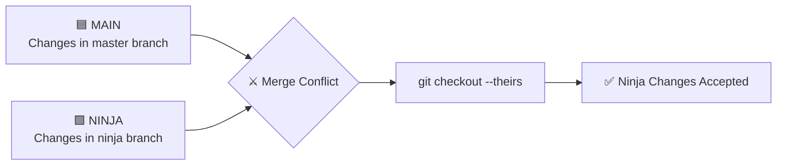
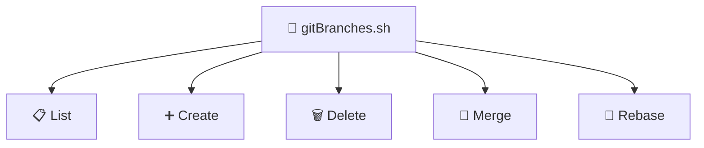
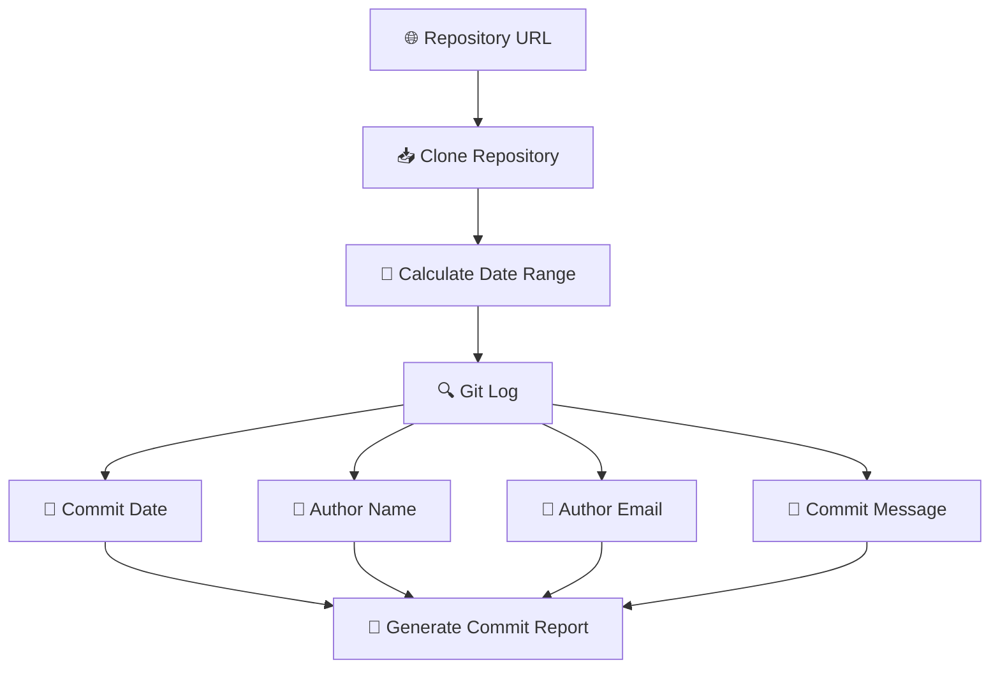

# Assignment-8_Linux

<p align="center">
  
  
  
</p>

---

## 📌 Objective

The objective of this assignment is to understand and implement important **Git and GitHub concepts** using practical commands and Bash scripting.

### 🎯 Topics Covered

* 🌿 Git Branch Management
* 🔀 Fast-Forward & Non-Fast-Forward Merge
* ⚔️ Merge Conflict Resolution
* 🧩 Ours & Theirs Concept
* 🔄 Git Rebase
* 🏷️ Git Tags
* 📊 Git Commit Reports
* 🐚 Bash Scripting
* 🤖 Git Command Automation

---

# 📂 Project Structure

```text
📦 Assignment-8_Linux
 ├── 📁 ninja
 │    └── 📄 README.md
 │
 ├── 📜 gitBranches.sh
 ├── 📜 gitTags.sh
 ├── 📜 gitCommitReport.sh
 └── 📘 README.md
```


---

# 🌿 PART A — Git Branching & Merge

## 1️⃣ Create Ninja Folder

A `ninja` directory is created at the root level of the repository.

```bash
mkdir ninja
echo "Trying fast forward merge" > ninja/README.md
```

The file contains:

```text
Trying fast forward merge
```


---

## 2️⃣ Create Ninja Branch

Create and switch to the `ninja` branch:

```bash
git checkout -b ninja
```

Check the current status:

```bash
git status
```


---

## 3️⃣ Commit Changes

Add and commit the README file:

```bash
git add ninja/README.md
git commit -m "Add ninja README"
```


---

## 4️⃣ Merge Ninja into Main

Switch to the main branch:

```bash
git checkout main
```

```bash
git merge ninja -m "Merge ninja branch"
```


---

# ⚔️ 5️⃣ Generate Merge Conflict

After the first merge, modify `README.md` differently on both branches.

### 🟦 Main Branch

```bash
git checkout main

echo "Changes in master branch" > ninja/README.md

git add ninja/README.md
git commit -m "Update README in master"
```


### 🟩 Ninja Branch

```bash
git checkout ninja

echo "Changes in ninja branch" > ninja/README.md

git add ninja/README.md
git commit -m "Update README in ninja"
```


Both branches have now modified the same file differently.

---

## 💥 6️⃣ Merge Conflict

Switch to main:

```bash
git checkout main
```

Merge ninja:

```bash
git merge ninja
```

Git generates a conflict because both branches modified the same file.

Check the conflict:

```bash
git status
```


---

# 🧩 7️⃣ Resolve Conflict Using `THEIRS`

In Git:

| Concept     | Meaning             |
| ----------- | ------------------- |
| 🟦 `ours`   | Current branch      |
| 🟩 `theirs` | Branch being merged |

Here:

```text
Current branch = main
Merged branch  = ninja
```

The assignment requires the **ninja changes to override the main changes**.

Therefore, use:

```bash
git checkout --theirs ninja/README.md
```

Then stage and commit:

```bash
git add ninja/README.md
git commit -m "Resolve merge conflict using ninja changes"
```

Verify:

```bash
cat ninja/README.md
```

Expected output:

```text
Changes in ninja branch
```


### 🧠 Ours vs Theirs



---

# 🔄 Good To Do — Rebase

Rebase is used to replay commits from one branch on top of another branch.

```bash
git checkout ninja
git rebase main
```


The ninja commits are replayed on top of the latest main branch.

### ⚠️ Rebase Conflict

If a conflict occurs:

```bash
git status
```

Resolve the conflict and run:

```bash
git add ninja/README.md
git rebase --continue
```

To cancel the rebase:

```bash
git rebase --abort
```

---

# 🛠️ PART B — Git Branch Management Script

## 📜 `gitBranches.sh`

The `gitBranches.sh` script automates common branch operations.

### ✨ Features

* 📋 List branches
* ➕ Create branch
* 🗑️ Delete branch
* 🔀 Merge branches
* 🔄 Rebase branches

---

## 📋 List Branches

```bash
./gitBranches.sh -l
```

Example:

```text
main
ninja
```


---

## ➕ Create Branch

```bash
./gitBranches.sh -b feature1
```


---

## 🗑️ Delete Branch

```bash
./gitBranches.sh -d feature1
```


---

## 🔀 Merge Two Branches

```bash
./gitBranches.sh -m -1 ninja -2 main
```

This means:

```text
ninja → main
```


The `ninja` branch is merged into the `main` branch.

---

## 🔄 Rebase Two Branches

```bash
./gitBranches.sh -r -1 ninja -2 main
```

This means:

```text
ninja → rebase on main
```


### 📊 Branch Script Flow



---

# 🏷️ PART C — Git Tag Management

## 📜 `gitTags.sh`

The `gitTags.sh` script manages Git tags.

### ✨ Features

* 🏷️ Create tag
* 📋 List tags
* 🗑️ Delete tag

---

## 🏷️ Create Tag

```bash
./gitTags.sh -t ninja_1.0
```

```bash
./gitTags.sh -t ninja_1.1
```


---

## 📋 List Tags

```bash
./gitTags.sh -l
```

Output:

```text
ninja_1.0
ninja_1.1
```


---

## 🗑️ Delete Tag

```bash
./gitTags.sh -d ninja_1.0
```


---

# 📊 PART D — Git Commit Report

## 📜 `gitCommitReport.sh`

The `gitCommitReport.sh` script generates a report containing information about commits made within a specified number of days.

### 📥 Input

The script accepts:

* 🌐 Repository URL
* 📅 Number of days

### 📤 Output

The report contains:

| Field             | Description                    |
| ----------------- | ------------------------------ |
| 📅 Commit Date    | Date and time when the commit was created      |
| 👤 Author Name    | Name of commit author          |
| 📧 Author Email   | Author email address           |
| 💬 Commit Message | Commit description             |

---

## ▶️ Usage

```bash
./gitCommitReport.sh -u https://github.com/tanushi108/Assignment-1.1_Linux.git -d 40
```


---

# 🔎 Commit Report Flow



---

# 🧪 Testing

Before submitting the assignment, verify the scripts.

### Branch Script

```bash
./gitBranches.sh -l
./gitBranches.sh -b testbranch
./gitBranches.sh -l
./gitBranches.sh -d testbranch
```

### Tag Script

```bash
./gitTags.sh -t test_1.0
./gitTags.sh -l
./gitTags.sh -d test_1.0
```

### Commit Report

```bash
./gitCommitReport.sh -u <repository-url> -d 10
```

---

# 📁 Final Repository Structure

```text
📦 Assignment-8_Linux
 ├── 📁 ninja
 │    └── 📄 README.md
 │
 ├── 📜 gitBranches.sh
 ├── 📜 gitTags.sh
 ├── 📜 gitCommitReport.sh
 └── 📘 README.md
```

---

# 🧠 Git Concepts Learned

| Concept        | Purpose                                              |
| -------------- | ---------------------------------------------------- |
| 🌿 Branch      | Work independently without affecting another branch  |
| 🔀 Merge       | Combine changes from different branches              |
| ⚔️ Conflict    | Occurs when Git cannot automatically combine changes |
| 🟦 Ours        | Keep changes from the current branch                 |
| 🟩 Theirs      | Keep changes from the branch being merged            |
| 🔄 Rebase      | Replay commits on top of another branch              |
| 🏷️ Tag        | Mark a specific commit/version                       |
| 📊 Git Log     | View commit history                                  |
| 🐚 Bash Script | Automate Git operations                              |

---
---

## 👩‍💻 Author

**Tanushi Rana**

⭐ *Git • GitHub • Linux • Bash Scripting*
